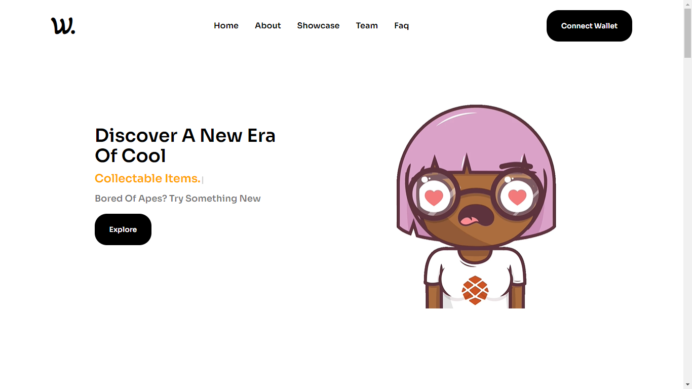
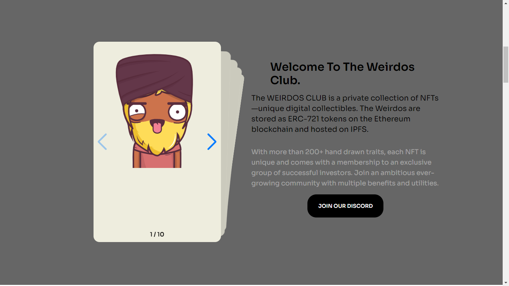
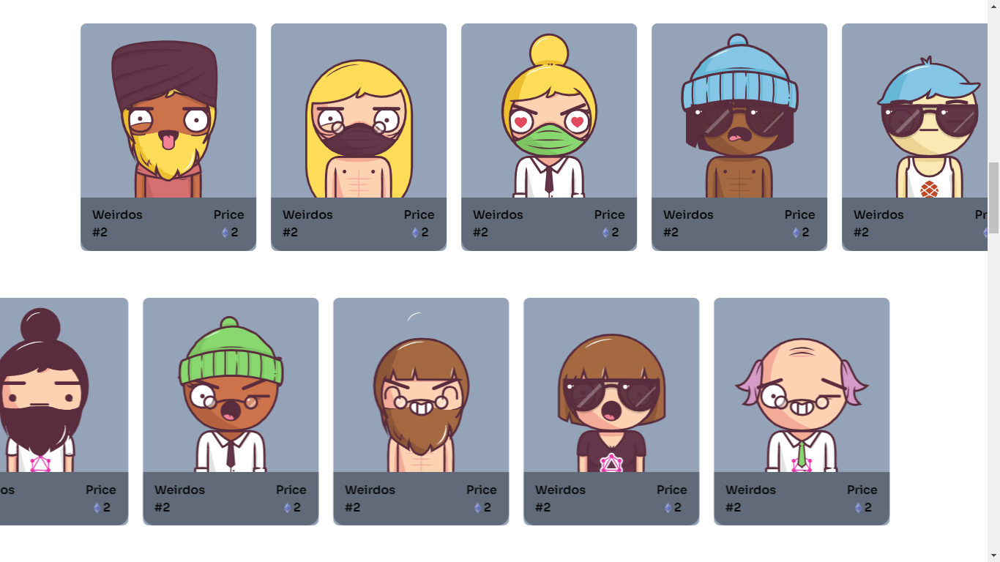
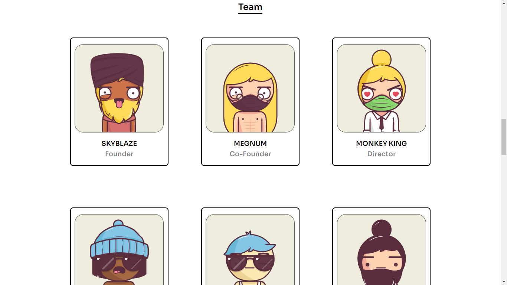
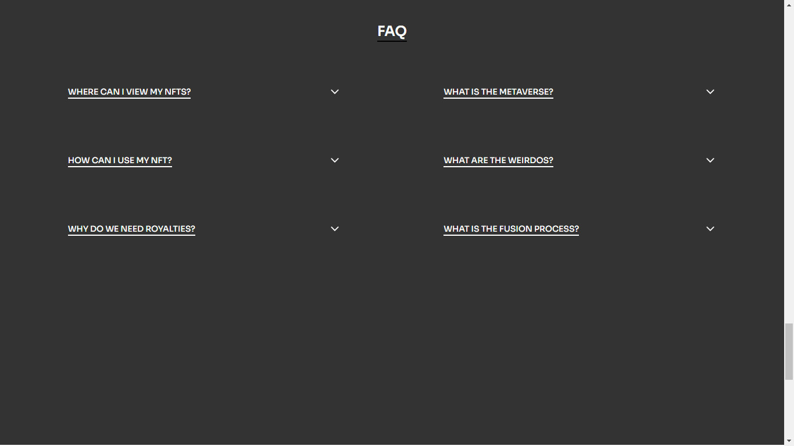
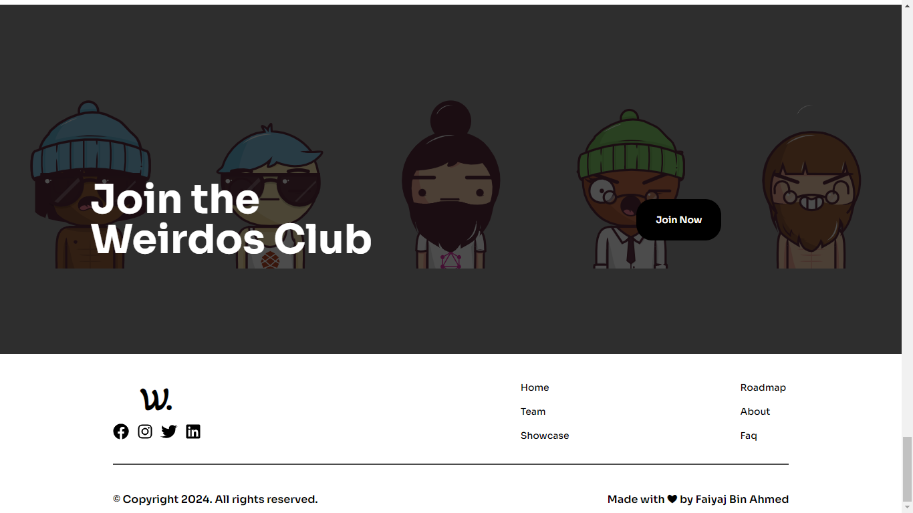

# The WEIRDOS

The Weirdos Club is an exclusive NFT platform showcasing a private collection of unique digital collectibles. These one-of-a-kind Weirdos are securely stored as ERC-721 tokens on the Ethereum blockchain and are seamlessly hosted on IPFS for decentralized accessibility. Built with cutting-edge technologies, the platform is crafted using React for dynamic user interactions and Tailwind CSS for a sleek and responsive design. Join The Weirdos Club to explore and own these distinct NFTs, each a masterpiece in the world of digital collectibles.

### Frameworks I worked with

This app is built on seven frameworks that are shown below.

- [![React][React]][ReactUrl]
- [![TailwindCss][Tailwind]][TailwindUrl]

### Live Demonstration

The-Weirdos is live here [Project](https://the-weirdos-two.vercel.app/)

Here are the screenshots of the The-Weirdos Website

**Home Page**


---

**About Page**


---

**Showcase Page**


---

**Team**


---

**Faq**


**Footer**


## Getting Started

To get started you can simply clone this `The-Weirdos` repository and install the dependencies.

Clone the `The-Weirdos` repository using git:

```bash
git clone https://github.com/faiyaj7/The-Weirdos
cd The-Weirdos
```

Install dependencies with this command:

```bash
npm install
```

Run the application with this command:

```bash
npm start
```

[React]: https://img.shields.io/badge/React-20232A?style=for-the-badge&logo=react&logoColor=61DAFB
[ReactUrl]: https://reactjs.org/
[Tailwind]: https://img.shields.io/badge/tailwindcss-%2338B2AC.svg?style=for-the-badge&logo=tailwind-css&logoColor=white
[TailwindUrl]: https://tailwindcss.com
